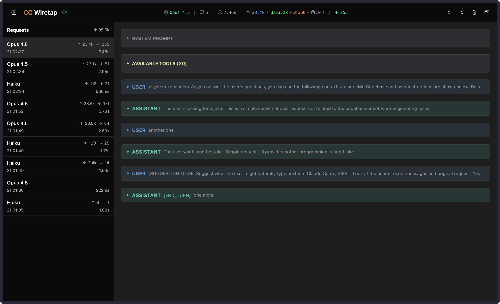

# CC Wiretap

HTTP/HTTPS proxy for intercepting and visualizing Claude Code API traffic in real-time.



## Quick Start

```bash
# Run the proxy
npx cc-wiretap

# In another terminal, configure it for proxying
eval "$(curl -s http://localhost:8082/setup)"

# Now run Claude Code - all API traffic will be captured
claude
```

Open http://localhost:3000 to view the dashboard.

## What It Does

CC Wiretap acts as a man-in-the-middle proxy that intercepts all traffic between Claude Code CLI and the Anthropic API. It captures requests and responses in real-time and displays them in a web dashboard.

**Use cases:**
- Debug Claude Code conversations and tool calls
- Analyze token usage and API costs
- Inspect system prompts and tool definitions
- Monitor streaming responses as they happen
- Understand how Claude Code works under the hood

## Installation

### npx (no install)

```bash
npx cc-wiretap
```

### Global install

```bash
npm install -g cc-wiretap
cc-wiretap
```

### From source

```bash
git clone https://github.com/wierdbytes/cc-wiretap.git
cd cc-wiretap
pnpm install
pnpm dev
```

## Usage

### 1. Start the proxy

```bash
cc-wiretap
```

Options:
- `-p, --port <port>` - Proxy server port (default: 8080)
- `-w, --ws-port <port>` - WebSocket server port (default: 8081)
- `-u, --ui-port <port>` - UI dashboard port (default: 3000)
- `-q, --quiet` - Suppress banner output

### 2. Configure your terminal

**Recommended: One-liner setup**

```bash
eval "$(curl -s http://localhost:8082/setup)"
```

This configures all necessary environment variables for the current shell session.

To disable:
```bash
unset-wiretap
```

**Fish shell:**
```bash
eval (curl -s http://localhost:8082/setup?shell=fish)
```

**Manual setup:**
```bash
NODE_EXTRA_CA_CERTS="$HOME/.cc-wiretap/ca.pem" \
HTTPS_PROXY=http://localhost:8080 \
claude
```

### 3. Open the dashboard

Navigate to http://localhost:3000 in your browser.

## Dashboard Features

### Header
Displays connection status, current request info, token usage with cache breakdown, and rate limit indicators.

### Requests Panel (Sidebar)
Lists all intercepted API requests in chronological order. Shows total input tokens sent. Toggle with `S` key.

### Request Detail View
When a request is selected, displays a collapsible report with:

| Section | Description |
|---------|-------------|
| **System Prompt** | System instructions sent to the API (collapsible) |
| **Available Tools** | Tool definitions with names, descriptions, and input schemas |
| **Messages** | User and assistant messages with content preview when collapsed |
| **Thinking Blocks** | Extended thinking content (when present) |
| **Tool Calls** | Tool invocations with input parameters |
| **Tool Results** | Results returned from tool executions |
| **Response** | Assistant response with stop reason indicator |

### Keyboard Shortcuts

| Key | Action |
|-----|--------|
| `S` | Toggle sidebar |
| `F` | Fold all content blocks |
| `E` | Expand all content blocks |
| `Space` | Select last request |
| `1` | Toggle system prompt visibility |
| `2` | Toggle tools visibility |
| `3` | Toggle messages visibility |
| `X` | Clear all requests |
| `?` | Show hotkeys help |

## Ports

| Port | Service |
|------|---------|
| 8080 | HTTP/HTTPS proxy |
| 8081 | WebSocket (proxy to UI communication) |
| 8082 | Setup server (terminal configuration endpoint) |
| 3000 | Web dashboard |

## CA Certificate

On first run, a CA certificate is generated at `~/.cc-wiretap/`:
- `ca.pem` - Certificate
- `ca-key.pem` - Private key

The setup script automatically configures `NODE_EXTRA_CA_CERTS` and other environment variables to trust this certificate.

**Optional: Trust system-wide**

macOS:
```bash
sudo security add-trusted-cert -d -r trustRoot \
  -k /Library/Keychains/System.keychain ~/.cc-wiretap/ca.pem
```

Linux (Debian/Ubuntu):
```bash
sudo cp ~/.cc-wiretap/ca.pem /usr/local/share/ca-certificates/cc-wiretap.crt
sudo update-ca-certificates
```

## Environment Variables

The setup script configures these variables:

| Variable | Purpose |
|----------|---------|
| `HTTP_PROXY`, `HTTPS_PROXY` | Proxy address |
| `NODE_EXTRA_CA_CERTS` | Node.js CA certificate |
| `SSL_CERT_FILE`, `REQUESTS_CA_BUNDLE` | Python/OpenSSL |
| `CURL_CA_BUNDLE` | curl |
| `GIT_SSL_CAINFO` | Git HTTPS |
| `AWS_CA_BUNDLE` | AWS CLI |
| `NO_PROXY` | Localhost exclusions |

## How It Works

1. **Proxy** intercepts HTTPS traffic to `api.anthropic.com` and `api.claude.ai`
2. **Interceptor** parses Claude API request/response format
3. **SSE Parser** handles streaming responses in real-time
4. **WebSocket** broadcasts events to connected dashboard clients
5. **Dashboard** renders the intercepted data with filtering and formatting

The proxy captures traffic without modifying it - your Claude Code sessions work exactly as they would without the proxy.

## License

MIT
